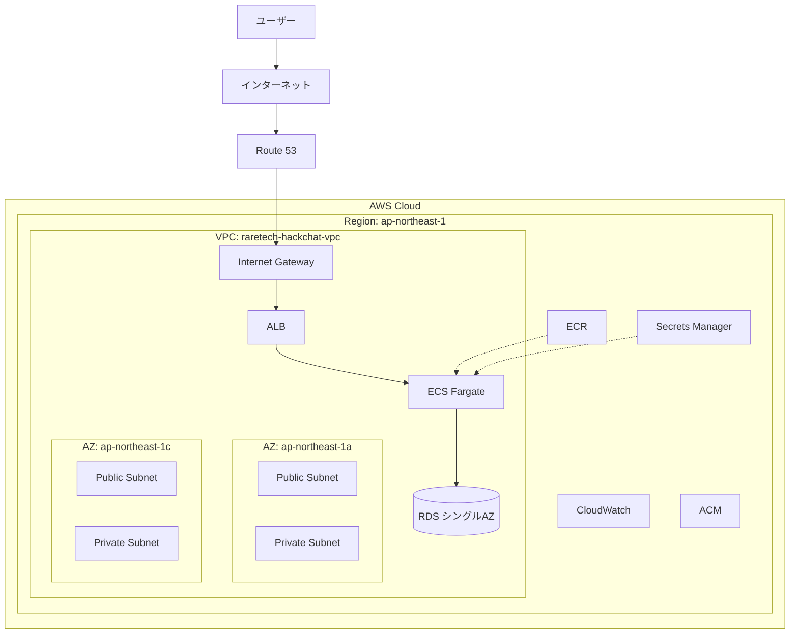

# HackChat AWS アーキテクチャ

## CloudFront について

**CloudFront は使用していません。**

| 方式 | いまの構成 |
|------|-----------|
| **ALB 直接** | ユーザー → Route 53 → ALB → ECS ✅ 採用 |
| **CloudFront 経由** | ユーザー → CloudFront → ALB → ECS ❌ 未使用 |

CloudFront は CDN（キャッシュ・全世界配信）向けです。ハッカソン規模では ALB + ACM で HTTPS 化する構成で十分です。

---

## 図の階層（AWS 公式の描き方）

```
AWS Cloud
  └── Region (ap-northeast-1)
        ├── VPC (raretech-hackchat-vpc)
        │     ├── AZ: ap-northeast-1a
        │     │     ├── Public Subnet  → ALB
        │     │     └── Private Subnet → ECS, RDS
        │     └── AZ: ap-northeast-1c
        │           ├── Public Subnet  → NAT Gateway
        │           └── Private Subnet → ECS（タスク配置可）
        └── リージョンサービス（VPC外）: ECR, Secrets Manager, CloudWatch, ACM
```

## Availability Zone（AZ）について

**AZ を別途「作成」したわけではありませんが、2 つの AZ を使っています。**

| 項目 | いまの構成 |
|------|-----------|
| AZ | **ap-northeast-1a** と **ap-northeast-1c** の 2 つ |
| サブネット | 各 AZ に Public / Private が 1 つずつ（計 4 サブネット） |
| ALB / ECS | 複数 AZ にまたがって配置 |
| RDS | **シングル AZ**（1a のみ、マルチ AZ ではない） |

AZ は AWS が東京リージョン内に最初から用意しているデータセンター群です。VPC 作成時に「2 AZ でサブネットを作る」を選んだことで、自動的に 2 AZ を利用している状態です。

## 構成図（Mermaid）



---

## リソース一覧

| サービス | 名前 | 役割 |
|----------|------|------|
| VPC | `raretech-hackchat-vpc` | ネットワーク |
| ALB | `hackchat-alb` | HTTP/HTTPS の入口 |
| ECS | `hackchat-cluster` / `hackchat-service` | Flask アプリ実行 |
| RDS | `hackchat-db` | MySQL (`chatapp`) |
| ECR | `hackchat-app` | Docker イメージ |
| Secrets Manager | `hackchat/app-secrets` | DB パスワード等 |
| CloudWatch | `/ecs/hackchat-task` | コンテナログ |
| Route 53 | （取得ドメイン） | DNS |
| ACM | （証明書） | ALB の HTTPS |

---

## 編集可能な図（draw.io）

AWS 公式アイコン付きの図は以下を [draw.io](https://app.diagrams.net/) で開いてください。

```
docs/hackchat-aws-architecture.drawio
```

1. https://app.diagrams.net/ を開く
2. **ファイル → デバイスから開く** → 上記ファイルを選択
3. 必要に応じてレイアウトやラベルを編集
4. **ファイル → エクスポート** → PNG / PDF で発表資料に使える
